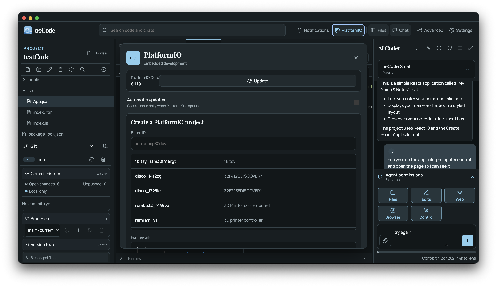
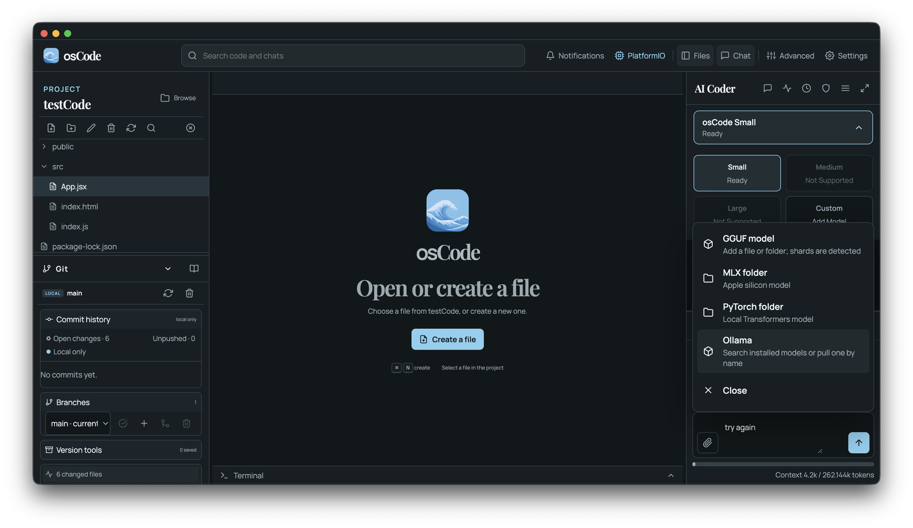

  

  

  

  

osCode is a local AI coding IDE. It was designed to feature a simple design while being private and removing telemetry found in other IDEs. osCode features osCode Models as its agentic coding AI model. These models were derived from Qwen 3.8 Max and have been rebuilt and reconstructed to fit machines with 8 GB of RAM. osCode was designed from the ground up to have NO TELEMETRY. This is core principle for the IDE.

This is a cross-platform Electron editor that supports Windows, macOS, and Linux. osCode is designed to be agentic with advanced features such as in-built browser for the AI agent to test and debug code. A further advanced feature, Compute Control, allows the AI agent to take control of the IDE and autonomously action commands. It can also control some desktop apps and I would like to further expand this. Again, all local and private and these features are all turned off by default. You will need to activate them and of course exercise caution as they may be dangerous and the AI model can send, receive, or manipulate data. You can also run your own local AI agent through Llama.cpp, PyTorch, and Ollama.

To install please check releases.

## Local Ai coding agent

- osCode comes with a local AI coding model. osCode Models are derived from Qwen 3.8 Max and rebuilt to run locally with a min of 8 GB of RAM. Models come in 3 sizes: Small, Medium, and Large. Models are downloaded within the app from this repo: https://github.com/OmerDesignX/osCode-Models

- osCode Models can make mistakes and may be slow to run depending on your computer's hardware. However, it is all private and local. No cloud compute costs attached.

## Ai Agency and Permissions

- You can give osCode as little or full control. It can access all of your files, browse using it's own integrated browser, use Computer Control to see your desktop apps including osCode and click and control your computer.

- You can turn this all off and this is OFF by DEFAULT. It is only turned on when you grant permission or toggle the permissions on. You can revoke access at any time.

## Python

- There is an integrate Python environment and 3.10, 3.11, and 3.12 are included. You can run Python scripts right from osCode. Install packages or create your own environments per project.

## Platform IO Support

- You can download the Platform IO core and create projects. A cache of the boards are saved locally and refreshed upon updates. This is untested still so bear with me while I work through this function.

## Git

- Git support with local or remote links supported.

## Supported systems

- Windows 10 on 64-bit Intel or AMD systems
- Windows 11 on 64-bit Intel or AMD systems
- macOS 12 Monterey or newer; choose the Intel x64 or Apple-silicon arm64 DMG for the Mac
- Current 64-bit Debian and Ubuntu releases can build and run osCode from source

## Keyboard shortcuts

- `Ctrl/Cmd+O` — open a folder
- `Ctrl/Cmd+N` — create a file
- `Ctrl/Cmd+S` — save the active file
- `Ctrl/Cmd+Backtick` — toggle the terminal
- `Ctrl/Cmd+Shift+L` — toggle dark/light theme
- `Ctrl/Cmd+Shift+A` — toggle Advanced Mode

On Windows and Linux, press `Alt` to reveal the compact native application menu. Production builds intentionally omit reload and developer-tool commands.

## Architecture and safety

The renderer has no Node access. A sandboxed preload exposes narrow, validated IPC operations; file reads and writes are constrained to the opened project. Monaco and its language workers are bundled locally, so editing does not depend on a CDN. Git commands use argument arrays rather than a shell, and remote destinations are restricted to HTTPS, SSH, SCP-style SSH, or explicit file URLs. Release builds prepare checksum-verified `uv` and contained Python runtimes for their target platform. Later Python versions are installed only after the user asks for them. AI file tools reject traversal and symbolic-link escapes. Writes default to explicit approval, and terminal tools use executable-plus-argument arrays without a shell, a restricted command list, a project-only working directory, short timeouts, output limits, and a scrubbed environment. The dedicated agent browser uses a temporary sandboxed Electron session, denies device permissions and pop-ups, blocks credentials and private-network pages, and erases storage when closed.

Native Computer Control remains off until the user enables it and grants a matching permission. On Windows, the bundled Microsoft helper invokes UI Automation patterns or sets values without taking focus where the application permits it; mouse-simulation or `SendInput` is a last resort and is labelled **foreground pointer** in the top status area. On macOS, osCode's bundled helper uses the Accessibility API and draws an independent overlay cursor without moving the user's hardware pointer. macOS asks for operating-system Accessibility approval. Terminals, credential managers, authentication tools, system security controls, and native confirmations are blocked. Escape aborts the current native helper and closes its overlay. Linux continues to support Computer Control inside osCode and the dedicated agent browser; arbitrary desktop-app control is withheld until the desktop's user-approved RemoteDesktop portal is available through a bundled, distro-compatible implementation. No kernel driver is installed on any platform.

The model cannot use a capability until a matching permission grant exists. Opening another project resets files, edits, web, browser, and Computer Control to their safe defaults. A context meter shows the selected token budget and older chat is summarized locally before it fills. PyTorch/MLX packages run from a separate application-data environment rather than any project Python environment.

## Privacy

osCode contains no telemetry or analytics. Renderer HTTP and HTTPS requests are blocked. Local model inference, prompts, chat history, images, code, screenshots, Accessibility trees, and Computer Control actions remain on the computer. The Windows Computer Control child process is always launched with both `WINAPP_CLI_TELEMETRY_OPTOUT=1` and `DOTNET_CLI_TELEMETRY_OPTOUT=1`. Web, browser, file, edit, and Computer Control capabilities start off for every opened project.

Chats, goals, queues, schedules, permission grants, AI edit history, preferences, model references, and Python selections are encrypted at rest with AES-256-GCM. A random device key is protected by Windows DPAPI, macOS Keychain, or a Linux Secret Service/KWallet backend. osCode refuses Electron's unprotected Linux `basic_text` fallback. Authenticated encryption failures are not treated as empty data. Legacy plaintext prompt caches are removed during the encrypted-storage upgrade. Use **Settings → Open secure data** to find the records at `%APPDATA%\osCode\secure` on Windows, `~/Library/Application Support/osCode/secure` on macOS, or `~/.config/osCode/secure` on Linux. Each project has a non-reversible hash folder; chats use date-and-number names and each chat contains an `agentCode` folder. Project source, downloaded model weights, and executable runtimes remain ordinary files so compilers and inference engines can use them.

Optional AI web access requires both its visible toggle and a matching permission grant. The dedicated browser uses an in-memory, cache-disabled, sandboxed session. Public traffic is receive-only: GET and HEAD over HTTPS are allowed, while request bodies, uploads, form submissions, public-page typing/clicking, cookies, authorization, referrers, WebSockets, pings, and CSP reports are blocked. Suspicious paths, query strings, credentials, local paths, contact details, secrets, code-like payloads, private-network pages, non-HTTPS public pages, large responses, and redirect chains are blocked and produce a visible security notification. Search terms and requested public URLs necessarily leave the computer when web access is used; page responses come back to the local agent, but prompts, project files, images, and chat data are never posted by the agent. Active network use is shown beside the global search bar, and clicking its progress surface opens the timestamped notification detail.

Sensitive plaintext necessarily exists briefly in process memory while a chat is displayed or a local model is evaluating it; no desktop application can both use plaintext and guarantee that RAM never contains it. osCode minimizes this exposure, does not persist renderer state, passes llama.cpp prompts through a private stdin pipe instead of command-line arguments or prompt-cache files, and zeroes temporary key and serialization buffers where the runtime permits. It does not claim encrypted-in-use memory.

PlatformIO runs with `PLATFORMIO_SETTING_ENABLE_TELEMETRY=false`, and its stored telemetry setting is also disabled after installation. Absolute interpreter paths are never written into the project or Git. The remembered project can be cleared from the explorer toolbar. Network activity outside the receive-only AI browser occurs only when the user explicitly downloads an osCode model, asks Git to contact a configured remote, installs or updates a runtime or engine, fetches PlatformIO project packages, pulls a named model with the standalone Ollama CLI, or opts into application updates. osCode never downloads Ollama Desktop: it uses an existing `ollama` command or downloads the official command-line archive, starts its own loopback-only service, and sets `OLLAMA_NO_CLOUD=1`. Application updates contact only the official GitHub Releases feed and are disabled until the user accepts the one-time prompt or enables them in Settings. Every model and PlatformIO download is visible and cancellable. PlatformIO automatic updates are disabled unless the user opts in.

## Contributing and security

Contributions are welcome; see `CONTRIBUTING.md`. Please report vulnerabilities using the private process in `SECURITY.md` rather than a public issue.

## License

MIT — see `LICENSE`.
